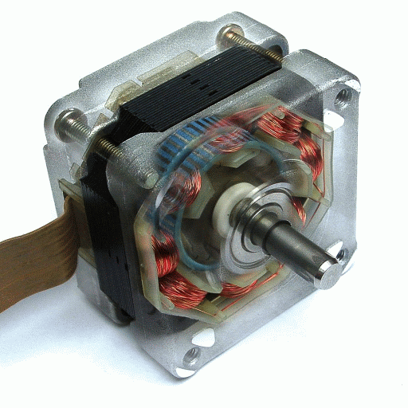
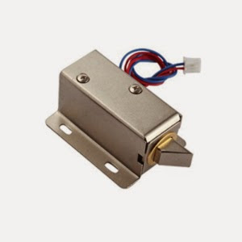
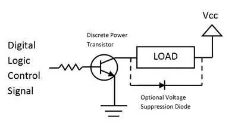

Aktoren
-------
***

> [⇧ **Home**](../README.md)

Aktoren (Wandler; Antriebselemente) setzen die elektronischen Signale in mechanische Bewegung oder andere physikalische Grössen um und greifen damit aktiv in die Umgebung des eingebetteten Systems ein.

**Beispiele**: 
* Dioden, 7-Segement-Anzeigen, Displays
* Ventile (Pneumatik, Hydraulik)
* Motoren (Gleichstrom/Wechselstrom)
* Magnete (Manipulatoren, Lautsprecher)

**Anwendungen**:
*   In vielen Robotern kommen Standard Boards mit individuellen Shield&#039;s zum Einsatz.
*   Der Siegeszug der DIY (Do-it-yourself) 3D Druckern, wäre ohne die Arduino Mega Boards nicht denkbar gewesen.
*   LED Strips eröffnen neue Möglichkeiten für die Dekorative Beleuchtungen von Gegenständen und Räumen.

### Beispiele

* [Servo](#Servo) 
* [DC Motor](#Gleichstrom-Motor) 
* [Schrittmotor](#Schrittmotor)
* [Türöffner](#türöffner)
* [RGB LED Streifen - 5 Volt](#RGB-LED-Streifen)
* [Fernseh Simulator](#Fernseh-Simulator)

* [Übungen](#Übungen)

## Servo 
***

> [⇧ **Nach oben**](#beispiele)

 

[http://wiki.rc-network.de/Servo](http://wiki.rc-network.de/Servo)

- - -

Der Servo (auch Rudermaschine) hat die Aufgabe, entsprechend dem Signal, dass er vom Empfänger erhält, die Ruder (oder andere Komponenten am Modell) zu stellen.

Servo lassen sich, in der Regel, von 0 - 180° bewegen. Der entsprechende Stellwinkel wird mittels eines Wert von 0.0 bis 1.0 angegeben.

Es gibt analoge und digitale Servos. Der Unterschied liegt darin, dass digitale Servo erst anfangen den Stellwinkel zu wechseln, wenn ein sauberes Signal anliegt.

Weitere Informationen und eine Ausführliche Einführung in Englisch [An Introduction to RC Servos](http://developer.mbed.org/users/4180_1/notebook/an-introduction-to-servos/)

### Anwendungen 

*   Steuerung von Roboterarmen
*   Modellflugzeuge
*   Schalten von Weichen auf der Modelleisenbahn

### Anschlussbelegung (Servo - Shield) 

Der Servo wird mit 5V betrieben und kann direkt auf einen der GND/+5V/S Header gesteckt werden. Das orange Kabel des Servo kommt auf S (Signal).

### Beispiel(e)

Das [Beispiel](Servos/src/main.cpp) bewegt 4 Servos. 

### Compilieren

| Umgebung/Board    | Link/Befehl                      |
| ----------------- | -------------------------------- |
| Online Compiler           | [Servos](https://os.mbed.com/compiler/#import:/teams/IoTKitV3/code/Servos/) |
| CLI (IoTKit K64F)         | `mbed compile -m K64F --source . --source ../IoTKitV3/actors/Servos;`   `cp BUILD/K64F/GCC_ARM/template.bin $DAPLINK` |
| CLI (DISCO_L475VG_IOT01A) | `mbed compile -m DISCO_L475VG_IOT01A -f --source . --source ../IoTKitV3/actors/Servos` |

## Gleichstrom Motor
***

> [⇧ **Nach oben**](#beispiele)

 

[Motoren](http://de.wikipedia.org/wiki/Elektromotor)

- - -

Elektromotor bezeichnet einen elektromechanischen Wandler (elektrische Maschine), der elektrische Energie in mechanische Energie umwandelt. In herkömmlichen Elektromotoren wird die Kraft, die von einem Magnetfeld auf die stromdurchflossenen Leiter einer Spule ausgeübt wird, in Bewegung umgesetzt.

Der Motor wird mittels eines float Wertes von full Speed rueckwärts (-1.0) nach full Speed vorwärts (1.0) angesprochen.

Ein ruhiger und schonender Motorlauf wird durch die Anpassung der PWM Periode (in Motor.cpp) erreicht. Diese PWM Periode bezieht sich auf die Motor Frequenz (siehe Datenblatt Motor) und wird wie folgt berechnet:

*   Periode (s) = 1 / Frequenz (Hz = 1/s)

Sourcecode aus Motor.cpp

    // Set initial condition of PWM
    _pwm.period( 1.0f / 50000 );

Ein Motor benötigt die [Motor Library](http://developer.mbed.org/users/simon/code/Motor/) und eine Verstärkerschaltung, wie z.B. eine [H-Brücke](http://de.wikipedia.org/wiki/Br%C3%BCckenschaltung). Eine H-Brücke braucht einen PWM Pin und zwei beliebige Digital Pins pro Motor. Es können zwei Motoren an die H-Bridge **M1** und **M2**  Header angeschlossen werden.

### Anwendungen 

*   Antrieb von Bahnen, Elektrokarren, Gabelstabel, Funkgesteuerte Modellautos (RC-Car), Robotern etc.

### Beispiel(e)

Das [Beispiel](Motors/src/main.cpp) bewegt 2 DC Motoren vorwärts und rückwärts. 

### Compilieren

| Umgebung/Board    | Link/Befehl                      |
| ----------------- | -------------------------------- |
| Online Compiler           | [Motors](https://os.mbed.com/compiler/#import:/teams/IoTKitV3/code/Motors/) |
| CLI (IoTKit K64F)         | `mbed compile -m K64F --source . --source ../IoTKitV3/actors/Motors;`   `cp BUILD/K64F/GCC_ARM/template.bin $DAPLINK` |
| CLI (DISCO_L475VG_IOT01A) | `mbed compile -m DISCO_L475VG_IOT01A -f --source . --source ../IoTKitV3/actors/Motors` |

## Schrittmotor
***

> [⇧ **Nach oben**](#beispiele)

[Schrittmotor](http://de.wikipedia.org/wiki/Schrittmotor)

- - - 

Ansteuerung Schrittmotor

- - - 

Ein Schrittmotor ist ein Synchronmotor, bei dem der Rotor (drehbares Motorteil mit Welle) durch ein gesteuertes, schrittweise rotierendes, elektromagnetisches Feld der Statorspulen (nicht drehbarer Motorteil) um einen minimalen Winkel (Schritt) oder sein Vielfaches gedreht werden kann.

Ein Schrittmotor hat eine fixe Schrittanzahl pro Umdrehung. Beim verwendeten [28BYJ-48](http://arduino-info.wikispaces.com/SmallSteppers) sind es 2048 Schritte.

Zur erstmaligen Positionierung wird, in der Regel, ein Endstop Schalter verwendet. [CNC Maschinen](http://de.wikipedia.org/wiki/CNC-Maschine) besitzen zusätzlich, wegen der Verletzungsgefahr einen Notstopp Schalter mit Einrastfunktion.

Ein unipolarer Schrittmotor benötigt einen IC Treiber (wie [ULN2803N](http://www.mikrocontroller.net/part/ULN2803)) und 4 Digitale Pins. Es kann je ein Schrittmotore an den Header **Stepper1** oder **Stepper2** angeschlossen werden.

Ein bipolarer Schrittmotor kann mittels der H-Brücke angesprochen werden, siehe Gleichstrom Motor und [Stepper bipolar](https://os.mbed.com/components/Stepper-motor-bipolar/)

### Anwendungen 

*   Typische Anwendungsgebiete sind Drucker oder der Antrieb des Schreib-/Lesekopfes in einem CDROM Laufwerken. Aufgrund ihrer hohen Genauigkeit werden sie auch in computergesteuerten Werkzeugmaschinen zur Positionierung der Werkzeuge verwendet. Durch die ständig sinkenden Kosten für die Ansteuerelektronik werden sie auch zunehmend im Konsumgüterbereich verwendet. So sind in Kraftfahrzeugen der mittleren und gehobenen Kategorie heute bis über 50 Schrittmotoren im Einsatz, die Betätigung der vielen Klappen einer automatischen Heizungs- und Klimaanlage ist dafür ein Beispiel.

### Beispiel(e)

Das [Beispiel](Steppers/src/main.cpp) bewegt 2 Schrittmotoren vorwärts und rückwärts. 

### Compilieren

| Umgebung/Board    | Link/Befehl                      |
| ----------------- | -------------------------------- |
| Online Compiler           | [Steppers](https://os.mbed.com/compiler/#import:/teams/IoTKitV3/code/Steppers/) |
| CLI (IoTKit K64F)         | `mbed compile -m K64F --source . --source ../IoTKitV3/actors/Steppers;`   `cp BUILD/K64F/GCC_ARM/template.bin $DAPLINK` |
| CLI (DISCO_L475VG_IOT01A) | `mbed compile -m DISCO_L475VG_IOT01A -f --source . --source ../IoTKitV3/actors/Steppers` |

## Türöffner
***

> [⇧ **Nach oben**](#beispiele)

[Elektromagnetischer Türöffner](http://de.wikipedia.org/wiki/T%C3%BCrschloss)

- - -

[Leistungsstufe (MOSFET o.ä.)](http://developer.mbed.org/users/4180_1/notebook/relays1/)

- - -

Türöffner gibt es auch als elektrisches Bauteil. Der Riegel wird durch einen elektromagnetischen Magnet geöffnet.

Damit genug Leistung vorhanden ist, wird eine Leistungsstufe, z.B. [MOSFET](http://de.wikipedia.org/wiki/Metall-Oxid-Halbleiter-Feldeffekttransistor), vorgeschaltet.

Der Türöffner wird an den MOSFET (Header **MOSFETs**) oder Schrittmotor Leistungsstufe (Header **STEPPER1** beim DISCO_L475VG_IOT01A Shield) angeschlossen und mittels DigitalOut angesprochen.

### Anwendungen 

*   Elektrische Türöffner
*   Schliesssysstem, z.B. in Verbindung mit [RFID Reader](http://de.wikipedia.org/wiki/RFID)

### Beispiel(e)

Das [Beispiel](DoorOpener/src/main.cpp) öffnet den Türschliesser beim Druck auf den Button.

### Compilieren

| Umgebung/Board    | Link/Befehl                      |
| ----------------- | -------------------------------- |
| Online Compiler           | [DoorOpener](https://os.mbed.com/compiler/#import:/teams/IoTKitV3/code/DoorOpener/) |
| CLI (IoTKit K64F)         | `mbed compile -m K64F --source . --source ../IoTKitV3/actors/DoorOpener;`   `cp BUILD/K64F/GCC_ARM/template.bin $DAPLINK` |
| CLI (DISCO_L475VG_IOT01A) | `mbed compile -m DISCO_L475VG_IOT01A -f --source . --source ../IoTKitV3/actors/DoorOpener` |

## RGB LED Streifen 
***

> [⇧ **Nach oben**](#beispiele)

[Beispiel Treppenbeleuchtung](http://developer.mbed.org/users/4180_1/notebook/relays1/)

- - - 

  |

[RGB LED Strip, siehe Wiki LadyAda](http://www.ladyada.net/wiki/products/ledstrip/index.html) 

- - -

LED Strips (RGB LED Streifen) eröffnen neue Möglichkeiten für die Dekorative Beleuchtungen von Gegenständen und Räumen.

LED Strips werden in Laufmetern mit einer definierten Anzahl von RGB LEDs pro Meter verkauft.

Es gibt unterschiedliche Arten der Ansteuerung, alle LED einer Farbe, jedes RGB LED einzeln.

Im aktuellen Beispiel verwenden wird ein 5V LED Strip mit einem Anschluss pro Farbe. Diese brauchen einen Verstärker, z.B. [MOSFET](http://de.wikipedia.org/wiki/Metall-Oxid-Halbleiter-Feldeffekttransistor).

Die LED Strip wird an den MOSFETs Header (+ ist oben) oder an die Stepper Leistungsstufe (Header **STEPPER1** beim DISCO_L475VG_IOT01A Shield) angeschlossen und benötigen für jede Farbe ein DigitalOut (An/Aus) oder PwmOut (Dimming).

### Anwendungen 

*   Raumbeleuchtung
*   Dekorative Ausleuchtung von Gegenständen

### Beispiel(e)

Das [Beispiel](RGBLEDStrip/src/main.cpp) bringt die 3 Farben (grün, rot, blau) nacheinnander und gemeinsam (= weiss) zum leuchten.

### Compilieren

| Umgebung/Board    | Link/Befehl                      |
| ----------------- | -------------------------------- |
| Online Compiler           | [RGBLEDStrip](https://os.mbed.com/compiler/#import:/teams/IoTKitV3/code/RGBLEDStrip/) |
| CLI (IoTKit K64F)         | `mbed compile -m K64F --source . --source ../IoTKitV3/actors/RGBLEDStrip;`   `cp BUILD/K64F/GCC_ARM/template.bin $DAPLINK` |
| CLI (DISCO_L475VG_IOT01A) | `mbed compile -m DISCO_L475VG_IOT01A -f --source . --source ../IoTKitV3/actors/RGBLEDStrip` |

### Links

* [DiiA: The global industry alliance for DALI lighting control](https://www.digitalilluminationinterface.org/)
* [Zhaga](https://www.zhagastandard.org/)

## Fernseh Simulator
***

> [⇧ **Nach oben**](#beispiele)

Mittels eine paar farbigen LEDs kann ein einfacher Fernseh Simulator erzeugt werden. Durch das Abwechslungsweise aufblicken der Farben Rot, Grün und Blau wird ein Fernseh ähnliches Lichtspiel erzeugt.

Solche Geräte werden, z.B. von Pearl verkauft.

### Beispiel(e)

Das [Beispiel](FernsehSimulatorLED/src/main.cpp) verwendet die Verbauten LEDs und den Zufallsgenerator vom Board.

### Compilieren

| Umgebung/Board    | Link/Befehl                      |
| ----------------- | -------------------------------- |
| Online Compiler           | [template](https://os.mbed.com/compiler/#import:/teams/IoTKitV3/code/template/) Importieren und Inhalt von main.cpp mit Beispielcode überschreiben |
| CLI (IoTKit K64F)         | `mbed compile -m K64F --source . --source ../IoTKitV3/actors/FernsehSimulatorLED;`   `cp BUILD/K64F/GCC_ARM/template.bin $DAPLINK` |
| CLI (DISCO_L475VG_IOT01A) | `mbed compile -m DISCO_L475VG_IOT01A -f --source . --source ../IoTKitV3/actors/FernsehSimulatorLED` |

### Links

* [Kommerzielle Produkte](https://www.pearl.ch/ch-kw-1-fernseh+simulator.shtml) 

## Übungen
***

> [⇧ **Nach oben**](#beispiele)

Ein paar der Übungen funktionieren nur mit dem IoTKitV3 K64F, weil der Encoder benötigt wird.

| Übung                     | Lösung       |
| ------------------------- | ------------ |
|  **Servo** nach links oder rechts bewegen mittels Encoder. Anwendung: Roboterarm bewegen.| [Lösung](01-Uebung/src/main.cpp) |
|  **Motor** mittels Encoder vor-, rückwärts Laufen lassen und zu stoppen.| [Lösung](02-Uebung/src/main.cpp) |
| Kombiniert den **Motor** mit **Abstandsmesser** (Ultraschall Sensor), damit der Motor vor einen Hindernis abstellt. | | 
|  **Schrittmotor** jeweils um 90° vor- und zurück bewegen.|  |

### Compilieren

| Umgebung/Board    | Link/Befehl                      |
| ----------------- | -------------------------------- |
| Online Compiler | [template](https://os.mbed.com/compiler/#import:/teams/IoTKitV3/code/template/) Importieren und Inhalt von main.cpp Übungscode überschreiben |
| CLI (IoTKit K64F) | `mbed compile -m K64F --source . --source ../IoTKitV3/actors/01-Uebung; `   `cp BUILD/K64F/GCC_ARM/template.bin $DAPLINK` |
| CLI (DISCO_L475VG_IOT01A) | `mbed compile -m DISCO_L475VG_IOT01A -f --source . --source ../IoTKitV3/actors/01-Uebung` |

* *01-Uebung* durch entsprechendes Übung Verzeichnis *02-Uebung* etc. ersetzen.