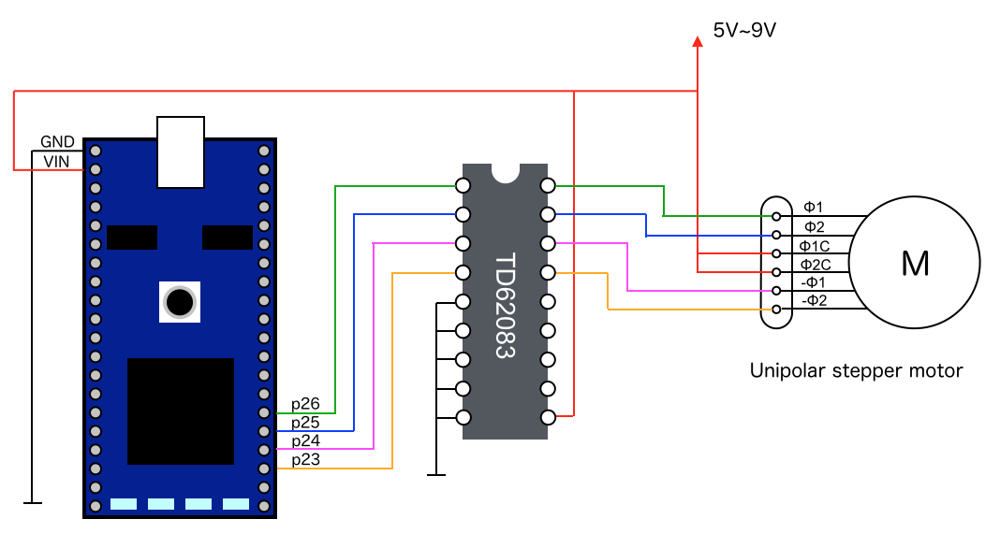

## Schrittmotor unipolar (Aktor) 

[Schrittmotor](http://de.wikipedia.org/wiki/Schrittmotor)

- - - 

Ansteuerung Schrittmotor

- - - 

Ein Schrittmotor ist ein Synchronmotor, bei dem der Rotor (drehbares Motorteil mit Welle) durch ein gesteuertes, schrittweise rotierendes, elektromagnetisches Feld der Statorspulen (nicht drehbarer Motorteil) um einen minimalen Winkel (Schritt) oder sein Vielfaches gedreht werden kann.

Ein Schrittmotor hat eine fixe Schrittanzahl pro Umdrehung. Beim verwendeten [28BYJ-48](http://arduino-info.wikispaces.com/SmallSteppers) sind es 2048 Schritte.

Zur erstmaligen Positionierung wird, in der Regel, ein Endstop Schalter verwendet. [CNC Maschinen](http://de.wikipedia.org/wiki/CNC-Maschine) besitzen zusätzlich, wegen der Verletzungsgefahr einen Notstopp Schalter mit Einrastfunktion.

Ein unipolarer Schrittmotor benötigt die [Schrittmotor Library](http://developer.mbed.org/users/okano/code/StepperMotorUni/) und einen IC Treiber (wie [ULN2803N](http://www.mikrocontroller.net/part/ULN2803)) und 4 Digitale Pin&#039;s.

Ein bipolarer Schrittmotor kann mittels der H-Brücke angesprochen werden, siehe Gleichstrom Motor und [Stepper bipolar](https://os.mbed.com/components/Stepper-motor-bipolar/)

### Anwendungen 

*   Typische Anwendungsgebiete sind Drucker oder der Antrieb des Schreib-/Lesekopfes in einem CDROM Laufwerken. Aufgrund ihrer hohen Genauigkeit werden sie auch in computergesteuerten Werkzeugmaschinen zur Positionierung der Werkzeuge verwendet. Durch die ständig sinkenden Kosten für die Ansteuerelektronik werden sie auch zunehmend im Konsumgüterbereich verwendet. So sind in Kraftfahrzeugen der mittleren und gehobenen Kategorie heute bis über 50 Schrittmotoren im Einsatz, die Betätigung der vielen Klappen einer automatischen Heizungs- und Klimaanlage ist dafür ein Beispiel.

### Links

*  [Arm Mbed Online Compiler](https://os.mbed.com/compiler/#import:/teams/IoTKitV3/code/Stepper/)
