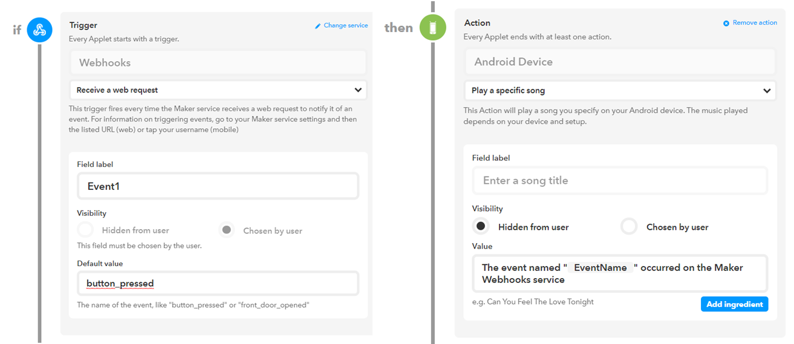

## IFTTT ("If This Then That")



- - -

IFTTT (die Abkürzung von "If This Then That") ist ein Dienstanbieter, der es Benutzern erlaubt, verschiedene Webanwendungen (zum Beispiel Facebook, Evernote, Dropbox usw.) mit einfachen Bedingten Anweisungen zu verknüpfen..

IFTTT ermöglicht Benutzern "Applets" nach dem Motto "If this then that" ("Wenn dies dann das") zu verknüpfen

*   Der "this"-Teil eines Applets wird "Trigger"
*   Der "that"-Teil eines Applets wird Aktion genannt.

Die eigentlichen Geräte / Dienste werden als **Services** bezeichnet.

### Webhook Service 

Der [Webhook Service](https://ifttt.com/maker_webhooks) ermöglicht es, IFTTT mit dem IoTKit zu verbinden.

Mit dem Webhook Service kann die IFTTT Plattform HTTP Aufrufe empfangen (Triggers) und Aktionen (Actions) auslösen.

### IFTTT einrichten und Applet erstellen 

**Um eine Aktion mittels Web Request auslösen:**

In dieser Variante löst das IoTKit einen Event mittels `HTTP GET` aus, welcher z.B. weiter an ein Smartphone geleitet wird um Musik abzuspielen.

* `New Applet` anwählen
* **if:** `Webhooks` und `receive a web request` wählen und Event-Name erfassen.
* **then:** `Add action`, z.B. `Android Device` und `Play a ...` wählen
* Name vergeben und speichern.
* Service `Webhooks` suchen und `Documentation`, oben rechts, anwählen. 
* Es erscheint eine Seite mit der Beschreibung `URL`, `API-Key` wie der Service aufgerufen werden kann. Der Aufruf ist in etwa wie folgt:

```cpp
	curl https://maker.ifttt.com/trigger/<Event-Name>/with/key/<your key>
```

Nach dem Ersetzen des Event-Names, durch den oben erfassten Event-Name, kann der URL 1:1 in das main.cpp in die Variable `finishMsg` übertragen werden.
Das Programm compilieren. Wird nun ein Magnet über den Hall-Sensor geführt, wird der Alarm ausgelöst, ein HTTP an die IFTTT Plattform gesendet welche diese weiter an die Aktion leitet.

### Links

*  [Arm Mbed Online Compiler](https://os.mbed.com/compiler/#import:/teams/IoTKitV3/code/HallSensorAlarm/)
