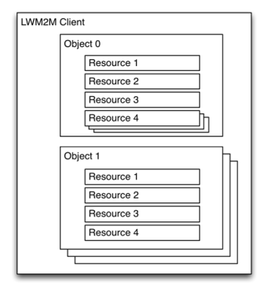
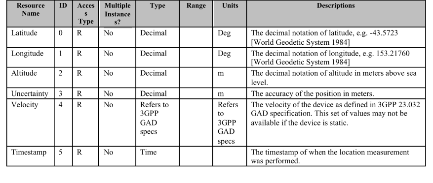

## CoAP (Constrained Application Protocol)
***

> [⇧ **Home**](../README.md)

 

Object Model

- - -

 

M2M Location Object mit 6 Ressourcen

Quelle: [OMA Lightweight M2M Tutorial](http://de.slideshare.net/zdshelby/oma-lightweightm2-mtutorial)

- - -
[Constrained Application Protocol (CoAP)](http://en.wikipedia.org/wiki/Constrained_Application_Protocol) ist ein Software-Protokoll welches für Internet der Dinge Geräte zugeschnitten ist.

CoAP ist auf den meisten Geräten, die UDP Unterstützen, lauffähig.

Ein CoAP fähiges Gerät publiziert seine Sensoren und Aktoren in einem Resource Directory oder stellt selber ein solches zur Verfügung.

Mittels Resource Discovery können die vorhandenen Sensoren und Aktoren mit ihren Attributen abgefragt werden.

Standardmässig sind folgende **Standard Device Management Objects** vorhanden

*   1 - Server
*   2 - Zugriffsberechtigungen
*   3 - Gerät
*   4 - Monitoring
*   5 - Firmware
*   6 - GPS Informationen

Komplettes Verzeichnis: [OMNA Lightweight M2M (LWM2M) Object & Resource Registry](http://technical.openmobilealliance.org/Technical/technical-information/omna/lightweight-m2m-lwm2m-object-registry)

### Beispiel(e)

Das Beispiel [coap-example](coap-example/src/main.cpp) schickt eine CoAP Meldung an coap.me.

Eine umfangreicheres und aktuelles Beispiel inkl. Anleitung findet man auf [ARM Pelion](https://www.pelion.com/iot-device-management/).

**Compilieren**

| Umgebung/Board    | Link/Befehl                      |
| ----------------- | -------------------------------- |
| Online Compiler | [coap-example](https://os.mbed.com/compiler/#import:/teams/IoTKitV3/code/coap-example/) |
| CLI (IoTKit K64F) | `mbed compile -m K64F --source . --source ../IoTKitV3/cloud/coap-example; `   `cp BUILD/K64F/GCC_ARM/template.bin $DAPLINK` |
| CLI (DISCO_L475VG_IOT01A) | `mbed compile -m DISCO_L475VG_IOT01A -f --source . --source ../IoTKitV3/cloud/coap-example` |

### Links 

*   [Office Hours - Pelion Device Management - Connect Service](https://www.youtube.com/watch?v=HUJcAscT5-s)
* 	[ARM CoAP YouTube Tutorial](https://www.youtube.com/watch?v=4bSr5x5gKvA&list=PLgyFKd2HIZlZNsrWXyE4kgLDo_tyLpvDW&index=7)
* 	[Eclipse Leshan YouTube Tutorial](https://www.youtube.com/watch?v=KZEi-Q7_EL0)
*   [ARM CoAP Tutorial](http://community.arm.com/servlet/JiveServlet/previewBody/8633-102-2-15471/ARM%20CoAP%20Tutorial%20April%2030%202014.pdf)
*   [mbed CoAP Beispiel (mbed V2)](https://os.mbed.com/components/Nanoservice/)
*   [mbed Client (mbed OS V5)](https://www.mbed.com/en/platform/mbed-client/)
*   [RFC 7252- COAP](https://tools.ietf.org/html/rfc7252)
*   [RFC 6690 - Constrained RESTful Environments (CoRE) Link Format](https://tools.ietf.org/html/rfc6690)
*   [RFC 5988 - Web Linking](https://tools.ietf.org/html/rfc5988)
* 	[NodeJS Coap Server](https://github.com/mcollina/node-coap)
* 	[NodeJS Coap CLI](https://www.npmjs.com/package/coap-cli)
*   [Building an internet connected lighting system](https://docs.mbed.com/docs/building-an-internet-connected-lighting-system/en/latest/)

