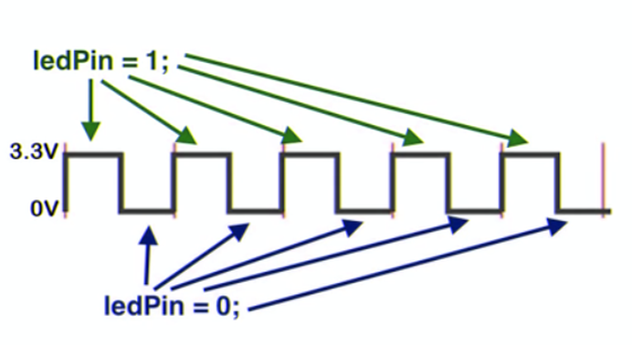

## PwmOut - Pulsweitenmodulation

Sinnbildliche Darstellung eines PWM Signals

- - -

[Pulsweitenmodulation](http://de.wikipedia.org/wiki/Pulsweitenmodulation) (kurz PWM), ist eine Modulationsart, bei der die elektrische Spannung zwischen Ground (0 Volt) und 3.3 Volt wechselt.

Die relative Länge des Pulses wird Tastgrad (englisch duty cycle) genannt.

Der Abstand zwischen dem Startpunkt zwei aufeinanderfolgender Pulse wird "Periode" genannt.

PwmOut kann nur mit Pins verwendet werden, welche mit PWM bezeichnet sind.

Das [Beispiel PWMOut](src/main.cpp) dimmt die LED D13 langsam auf und das [Beispiel PwmOutPeriod](../PwmOutPeriod/src/main.cpp) emuliert eine Polizeisierene mit dem Buzzer (Summer).

### Anwendungen 

*   Licht dimmen
*   Motoren Geschwindigkeit regeln
*   Töne erzeugen

Siehe auch: [mbed Handbook PwmOut](https://docs.mbed.com/docs/mbed-os-api-reference/en/latest/APIs/io/PwmOut/) und [YouTube Tutorial](https://www.youtube.com/watch?v=J5lsM1k-r-g&list=PLWy-YwxbAu8FDpD2saP1p6IFHgvbzODyc&index=3)

### Links

*  [Arm Mbed Online Compiler](https://os.mbed.com/compiler/#import:/teams/IoTKitV3/code/PwmOut/)
*  [Arm Mbed Online Compiler - Polizeisirene](https://os.mbed.com/compiler/#import:/teams/IoTKitV3/code/PwmOutPeriod/)
