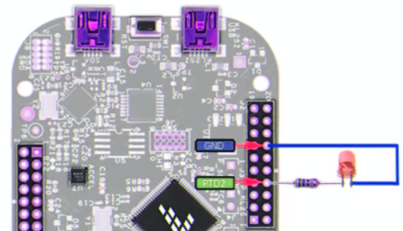
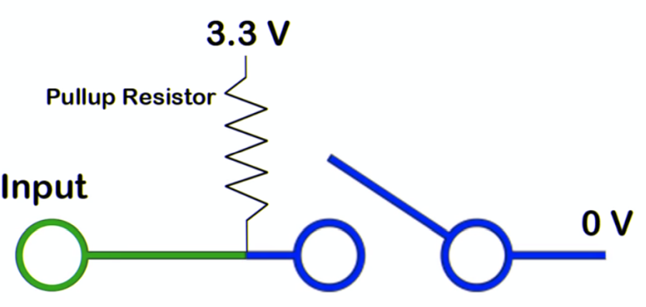

GPIO
----
***

Allzweckeingabe/-ausgabe (engl. GPIO - General Purpose Input/Output) ist ein allgemeiner Kontaktstift (Pin) an einem Mikrocontroller, dessen Verhalten, unabhängig, ob als Eingabe- oder Ausgabekontakt, durch logische Programmierung frei bestimmbar ist. GPIO-Kontakten ist kein Zweck vorgegeben, sie sind daher standardmäßig unbelegt.

Mittels folgender Grundklassen kann den GPIO Pins ein Zweck vorgegeben werden:

* [DigitalOut](#DigitalOut) -  Pin zwischen 0 (0 Volt) und 1 (3.3 Volt) hin und her schalten.
* [DigitalIn](#DigitalIn)  - liefert je nach Spannung: 0 Volt eine 0 oder 3.3 - 5 Volt eine 1.
* [AnalogIn](#AnalogIn)    - Umsetzung eines Analogssignals in einen Wert.
* [PwmOut](#PwmOut) -  Pulsweitenmodulation für die Erzeugung einer elektrische Spannung zwischen Ground (0 Volt) und 3.3 Volt.
* [Encoder Switch](#Encoder_Switch) - zählt die Impulse am Encoder und schaltet einen Zähler vor und zurück.

Standard Pins sind mit **D0 - D15**, **A0 - A5** (analog Arduino) oder **PTxx** gekennzeichnet. **RX/TX**, **SDA,SCL** und **SS, MOSI, MISO, SLCK** sind Pins für Bussysteme. 
Daneben sind  Pin mit Ground (**GND**) und +5 Volt (**+5V**) vorhanden um die Verkabelung von externen Sensoren und Aktoren zu vereinfachen.

## DigitalOut
***

> [⇧ **Nach oben**](#gpio)

Sinnbildliche Darstellung für den Anschluss eines LEDs. Der Name des Pins ist entsprechend Anzupassen.

- - -

Mittels DigitalOut kann ein Pin zwischen 0 (0 Volt) und 1 (3.3 Volt) hin und her geschaltet werden.

**Definition**

	DigitalOut led1( <GPIO-Pin Name> );
	
**Ansteuerung**

On

	led1 = 1;
	led1.write( 1 );

Off
	
	led1 = 0;
	led1.write( 0 );
	
Beide Varianten bei On/Off geben das gleiche Ergebnis. Die LED wird ein- und ausgeschaltet. Die erste Variante verwendet [Operator Overloading von C++] und die zweite die Methode `write`.

### Anwendungen 

*   Ansteuerung von LEDs, z.B. für Taschenlampe, [Kultpfunzel](http://kultpfunzel.ch/) , [Fernsehsimulator,](http://www.pearl.ch/ch-a-NC5312-3110.shtml) [Kleidung](http://www.get-a-led.de/led-t-shirts/led-kleidung-stereo-mc/), Statusanzeigen etc.
*   2 DigitalOut für die Richtungsbestimmung bei Motoren
*   4 DigitalOut für die Ansteuerung von Schrittmotoren

Siehe auch: [mbed Handbook](https://os.mbed.com/docs/mbed-os/latest/apis/digitalout.html) und [YouTube Tutorial](https://www.youtube.com/watch?v=kP_zHbC_5eM)

### Beispiel(e)

Das Beispiel [DigitalOut](DigitalOut/src/main.cpp) steuert die LEDs D10 - D13 nacheinnander an.

**Compilieren**

| Umgebung/Board    | Link/Befehl                      |
| ----------------- | -------------------------------- |
| Online Compiler | [DigitalOut](https://os.mbed.com/compiler/#import:/teams/IoTKitV3/code/DigitalOut/) |
| CLI (IoTKit K64F) | `mbed compile -m K64F --source . --source ../IoTKitV3/gpio/DigitalOut; `   `cp BUILD/K64F/GCC_ARM/template.bin $DAPLINK` |
| CLI (DISCO_L475VG_IOT01A) | `mbed compile -m DISCO_L475VG_IOT01A -f --source . --source ../IoTKitV3/gpio/DigitalOut` |

## DigitalIn
***

> [⇧ **Nach oben**](#gpio)

Schematische Darstellung: Anschluss eines Buttons
- - -

DigitalIn liest den Status eines Pins (als Input Bezeichnet) aus.

DigitalIn liefert je nach Spannung: 0 Volt eine 0 oder 3.3 - 5 Volt eine 1.

Damit Eindeutig zwischen 0 und 1 unterschieden werden kann, wird in der Regel mit PullUp Widerständen gearbeitet. Dies kann durch den internen PullUp Widerstand (zweiter Parameter bei DigitalIn, Default = ON).

### Anwendungen 

*   Externer Feedback, z.B. Taster.
*   Sensoren welche bei Eintreten eines Ereignisses zwischen 0 und 1 umschalten, z.B. Bewegungsmelder

**Siehe auch:** [mbed Handbook](https://os.mbed.com/docs/mbed-os/latest/apis/digitalin.html) und [YouTube Tutorial](https://www.youtube.com/watch?v=XmWqP8laxxk)

### Beispiel(e)

Das [Beispiel](DigitalIn/src/main.cpp) frägt den Taster vom Encoder ab.

### Compilieren

| Umgebung/Board    | Link/Befehl                      |
| ----------------- | -------------------------------- |
| Online Compiler | [DigitalIn](https://os.mbed.com/compiler/#import:/teams/IoTKitV3/code/DigitalIn/) |
| CLI (IoTKit K64F) | `mbed compile -m K64F --source . --source ../IoTKitV3/gpio/DigitalIn; `   `cp BUILD/K64F/GCC_ARM/template.bin $DAPLINK` |
| CLI (DISCO_L475VG_IOT01A) | `mbed compile -m DISCO_L475VG_IOT01A -f --source . --source ../IoTKitV3/gpio/DigitalIn` |

## AnalogIn
***

> [⇧ **Nach oben**](#gpio)

Sinnbildliche Darstellung eines Analogen Signals
- - -

Ein Analogsignal ist ein Signals mit stufenlosem und unterbrechungsfreiem Verlauf

In der Elektronik erfolgt die Umsetzung eines elektrischen Analogsignals in ein nutzbares Digitalsignal mittels Analog-Digital-Umsetzern (ADU), die umgekehrte Richtung erfolgt mittels Digital-Analog-Umsetzern (DAU).

Die Pins A0 - A5 haben integrierte Analog-Digital-Umsetzer. AnalogIn macht sich das zunutze und liefert die aktuelle analoge Spannung in Prozent (0.0 - 1.0) oder als short (0 - 65535).

### Anwendungen

*   Auslesen eines Sensorwertes, z.B. Lichtintensität
*   Zusammen mit einen [Potentiometer](http://de.wikipedia.org/wiki/Potentiometer) um einen Schwellenwert für ein Ereignis, z.B. für das Anschalten des Lichtes, oder um die Geschwindigkeit für einen Motor einzustellen.

**Siehe auch:** [mbed Handbook](https://os.mbed.com/docs/mbed-os/latest/apis/analogin.html) und [YouTube Tutorial](https://www.youtube.com/watch?v=LLXJ3KE1XZw)

### Beispiel(e)

Das [Beispiel](AnalogIn/src/main.cpp) frägt den Hallsensor (zur Ermittelung des Nord- oder Südpols eines Magneten) ab und bringt bei entsprechendem Pol die LED 1 zum leuchten.

### Compilieren

| Umgebung/Board    | Link/Befehl                      |
| ----------------- | -------------------------------- |
| Online Compiler           | [AnalogIn](https://os.mbed.com/compiler/#import:/teams/IoTKitV3/code/HallSensor/) |
| CLI (IoTKit K64F)         | `mbed compile -m K64F --source . --source ../IoTKitV3/gpio/AnalogIn;`   `cp BUILD/K64F/GCC_ARM/template.bin $DAPLINK` |
| CLI (DISCO_L475VG_IOT01A) | `mbed compile -m DISCO_L475VG_IOT01A -f --source . --source ../IoTKitV3/gpio/AnalogIn` |

## PwmOut - Pulsweitenmodulation
***

> [⇧ **Nach oben**](#gpio)

Sinnbildliche Darstellung eines PWM Signals

- - -

[Pulsweitenmodulation](http://de.wikipedia.org/wiki/Pulsweitenmodulation) (kurz PWM), ist eine Modulationsart, bei der die elektrische Spannung zwischen Ground (0 Volt) und 3.3 Volt wechselt.

Die relative Länge des Pulses wird Tastgrad (englisch duty cycle) genannt.

Der Abstand zwischen dem Startpunkt zwei aufeinanderfolgender Pulse wird "Periode" genannt.

PwmOut kann nur mit Pins verwendet werden, welche mit PWM bezeichnet sind.

### Anwendungen 

*   Licht dimmen
*   Motoren Geschwindigkeit regeln
*   Töne erzeugen

Siehe auch: [mbed Handbook](https://os.mbed.com/docs/mbed-os/latest/apis/pwmout.html) und [YouTube Tutorial](https://www.youtube.com/watch?v=J5lsM1k-r-g&list=PLWy-YwxbAu8FDpD2saP1p6IFHgvbzODyc&index=3)

### Beispiel(e)

* Das Beispiel [PWMOut](PwmOut/src/main.cpp) dimmt die LED 4 langsam auf.
* Das Beispiel [PwmOutPeriod](PwmOutPeriod/src/main.cpp) emuliert eine Polizeisierene mit dem Buzzer (Summer).

### Compilieren

| Umgebung/Board    | Link/Befehl                      |
| ----------------- | -------------------------------- |
| Online Compiler | [PwmOut](https://os.mbed.com/compiler/#import:/teams/IoTKitV3/code/PwmOut/) |
| CLI (IoTKit K64F) | `mbed compile -m K64F --source . --source ../IoTKitV3/gpio/PwmOut; `   `cp BUILD/K64F/GCC_ARM/template.bin $DAPLINK` |
| CLI (DISCO_L475VG_IOT01A) | `mbed compile -m DISCO_L475VG_IOT01A -f --source . --source ../IoTKitV3/gpio/PwmOut` |
| Online Compiler | [PwmOutPeriod](https://os.mbed.com/compiler/#import:/teams/IoTKitV3/code/PwmOutPeriod/) |
| CLI (IoTKit K64F) | `mbed compile -m K64F --source . --source ../IoTKitV3/gpio/PwmOutPeriod; `   `cp BUILD/K64F/GCC_ARM/template.bin $DAPLINK` |
| CLI (DISCO_L475VG_IOT01A) | `mbed compile -m DISCO_L475VG_IOT01A -f --source . --source ../IoTKitV3/gpio/PwmOutPeriod` |

## Encoder Switch
***

> [⇧ **Nach oben**](#gpio)

Ein Encoder Switch - zählt die Impulse am Encoder und schaltet einen Zähler vor und zurück

### Anwendungen

* Wert hoch- und runterzählen, z.B. um einen Motor zu Steuern, eine Lautstärke einzustellen etc.

### Beispiel(e)

* Das Beispiel [EncoderSwitch](EncoderSwitch/src/main.cpp) gibt die Anzahl Pulse auf dem Display aus.

### Compilieren

| Umgebung/Board    | Link/Befehl                      |
| ----------------- | -------------------------------- |
| Online Compiler | [EncoderSwitch](https://os.mbed.com/compiler/#import:/teams/IoTKitV3/code/EncoderSwitch/) |
| CLI (IoTKit K64F) | `mbed compile -m K64F --source . --source ../IoTKitV3/gpio/EncoderSwitch; `   `cp BUILD/K64F/GCC_ARM/template.bin $DAPLINK` |
| CLI (DISCO_L475VG_IOT01A) | `mbed compile -m DISCO_L475VG_IOT01A -f --source . --source ../IoTKitV3/gpio/EncoderSwitch` |
