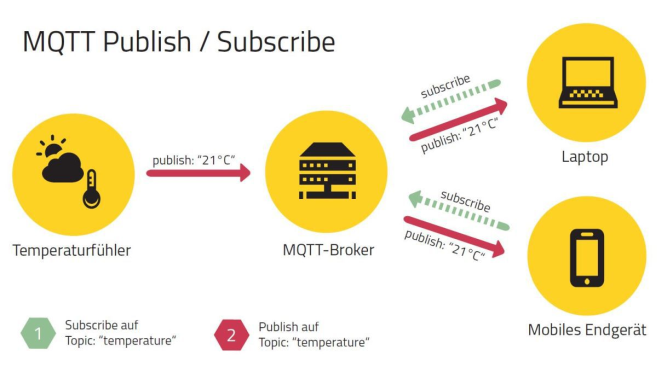

## MQTT (Message Queue Telemetry Transport)
***

> [⇧ **Home**](../README.md)

- - -

[Message Queue Telemetry Transport (MQTT)](http://de.wikipedia.org/wiki/MQ_Telemetry_Transport) ist ein offenes Nachrichten-Protokoll für Machine-to-Machine-Kommunikation (M2M), das die Übertragung von Messdaten-Daten in Form von Nachrichten zwischen Geräten ermöglicht, trotz hoher Verzögerungen oder beschränkten Netzwerken. Entsprechende Geräte reichen von Sensoren und Aktoren, Mobiltelefonen, Eingebetteten Systemen in Fahrzeugen oder Laptops bis zu voll entwickelten Rechnern. **MQTT basiert auf TCP-Sockets.**

MQTT implementiert das [**Publish/Subscribe-Pattern**](http://de.wikipedia.org/wiki/Beobachter_(Entwurfsmuster)). Es ersetzt die Punkt-zu-Punkt-Verbindungen durch einen zentralen Server (Broker), zu dem sich Datenproduzenten und -nutzer gleichermaßen verbinden können. Das Senden (publish) und Empfangen (subscribe) von Nachrichten funktioniert über sogenannte Topics. Ein **Topic** ist ein String, der eine Art Betreff der Nachricht darstellt, aber ähnlich einer Web Adresse aufgebaut ist.

Im obigen Beispiel funktioniert die komplette Kommunikation rein über Topics, und der Sensor (links) und die Endgeräte (rechts) wissen nichts über die Existenz des jeweils anderen.

### Beispiel Topics

	Zuhause/Wohnzimmer/Temperatur
	Zuhause/Wohnzimmer/Luftfeuchtigkeit
	Zuhause/Schlafzimmer/Temperatur
	Zuhause/Schlafzimmer/Luftfeuchtigkeit						

Topics haben noch ein weiteres wichtiges Konzept - Wildcards. In oben stehenden Codebeispiel sind vier Topics aufgelistet, und je ein Sensor sendet eine neue Nachricht auf den jeweiligen Topic, sobald sich ein Wert geändert hat. Man kann nun je nach Anwendungsfall Wildcards benutzen, um mehrere Topics zu abonnieren.

### Beispiel Wildcards 

	Zuhause/+/Temperatur
	Zuhause/Wohnzimmer/#
	#

Oben sind alle möglichen Wildcard-Operatoren aufgelistet. Im ersten Fall bekommt die mobile Anwendung nur alle Nachrichten über neue Temperaturwerte, im zweiten Fall nur alle Werte aus dem Wohnzimmer und im dritten Fall alle Werte. Dabei lässt sich der +-Operator immer nur für eine Hierarchiestufe einsetzen und der #-Operator für beliebig viele Hierarchiestufen mit der Bedingung, dass dieser am Ende stehen muss.

### Mechanismen zur Qualitätskontrolle 

Ein weiteres wichtiges Konzept sind die drei Servicequalitäten bei der Datenübertragung 0, 1 und 2. Die Zusicherung variiert von keiner Garantie (Level 0) über die, dass die Nachricht mindestens einmal ankommt (Level 1), bis hin zur Garantie, dass die Nachricht genau einmal ankommt (Level 2).

## MQTT Publish Beispiel
***

Mittels Publish (unten) kann eine Meldung zum MQTT Broker bzw. Topic gesendet werden.

Ein anderes Board oder der Mosquitto Client mosquitto_sub kann dieses Topic Abonnieren (subscribe).

### Client

Mittels der Client Utilities von [Mosquitto](https://projects.eclipse.org/projects/technology.mosquitto) können Werte abgefragt oder gesendet werden.

Beispiel: Abfragen der Werte von Temperatur und Luftfeuchtigkeit (Ausgabe: I2C Id, Temperatur, Luftfeuchtigkeit, Motorlaufgeschwindigkeit)

    mosquitto_sub -h broker.hivemq.com -t iotkit/sensor/#
    0xBC,22.90,36.9,low
    0xBC,28.00,36.7,middle
    0xBC,32.90,36.7,high

Beispiel: Abfragen ob jemand einen Magneten an den Hall Sensor gehalten hat
    
    mosquitto_sub -h broker.hivemq.com -t iotkit/alert/#

Sollte der Server nicht Antworten ist der MQTT Broker zu wechseln (Eintrag `hostname` in `MQTTPublish/src/main.cpp`). 

Eine Liste von Öffentlichen MQTT gibt es [hier](https://github.com/mqtt/mqtt.github.io/wiki/public_brokers).

### Beispiel(e)

Das Beispiel [MQTTPublish](MQTTPublish/src/main.cpp) sendet Sensordaten an einen MQTT Broker.

Ein weiteres Beispiel ist [MQTT on os.mbed.org](https://os.mbed.com/teams/mqtt/code/HelloMQTT/).

**Compilieren**

| Umgebung/Board    | Link/Befehl                      |
| ----------------- | -------------------------------- |
| Online Compiler | [MQTTPublish](https://os.mbed.com/compiler/#import:/teams/IoTKitV3/code/MQTTPublish/) |
| CLI (IoTKit K64F) | `mbed compile -m K64F --source . --source ../IoTKitV3/mqtt/MQTTPublish; `   `cp BUILD/K64F/GCC_ARM/template.bin $DAPLINK` |
| CLI (DISCO_L475VG_IOT01A) | `mbed compile -m DISCO_L475VG_IOT01A -f --source . --source ../IoTKitV3/mqtt/MQTTPublish` |

### Links 

*   [Ausführlicher Artikel auf heise.de](http://www.heise.de/developer/artikel/MQTT-Protokoll-fuer-das-Internet-der-Dinge-2168152.html)
*   [MQTT Team auf mbed.org](https://os.mbed.com/teams/mqtt/)
*   [MQTT JavaScript Client Library für node.js und Browser](https://github.com/mqttjs/MQTT.js)
*   [Eclipse Paho, Client Libraries für Verschiedene Sprachen](http://www.eclipse.org/paho/)
*   [Practical MQTT with Paho](http://www.infoq.com/articles/practical-mqtt-with-paho)
*   [Paho UI Utilities für MQTT](https://wiki.eclipse.org/Paho/GUI_Utility)

