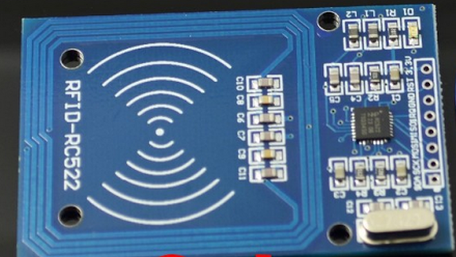

## NFC / RFID 
***

> [⇧ **Home**](../README.md)

[RFID Tags](http://de.wikipedia.org/wiki/Near_Field_Communication)

- - -

Die Nahfeld Kommunikation (Near Field Communication, Abkürzung NFC) ist ein internationaler Übertragungsstandard zum kontaktlosen Austausch von Daten per Funktechnik über kurze Strecken von wenigen Zentimetern und einer Datenübertragungsrate von maximal 424 kBit/s. Bisher kommt diese Technik vor allem in Lösungen für Micropayment – bargeldlose Zahlungen kleiner Beträge – zum Einsatz.

Die Übertragung erfolgt entweder verbindungslos (mit passiven HF-RFID-Tags nach ISO 14443 oder ISO 15693) oder Verbindungsbehaftet (zwischen gleichwertigen aktiven Transmittern). Die verbindungslose Nutzung ist nach üblicher Definition (beispielsweise in ISO 15408, den „Common Criteria“) nicht sicher gegen Angriffe von Dritten.

Die Technik hinter NFC basiert auf der englisch [radio-frequency identification (RFID).](http://de.wikipedia.org/wiki/RFID)

### Anwendungen

*   Bargeldloser Zahlungsverkehr (girogo, Paypass, Visa payWave, Google Wallet, Apple Pay etc.)
*   papierlose Eintrittskarten
*   Abrechnung von Beförderungsdienstleistungen (zum Beispiel Touch and Travel)
*   Zugangskontrolle
*   Wächterkontrollsysteme zum Nachweis der Anwesenheit eines NFC-Lesegerätes an einem bestimmten Kontrollpunkt mit montierten oder geklebtes NFC-Tag. Steuerung des Smartphones durch im Handel verfügbare NFC-Tags (z. B. SmartTags von Sony, TecTiles von Samsung, oder universell einsetzbare BluewaveTags)

## RFID (Sensor, SPI)
***

> [⇧ **Nach oben**](#beispiele)

 

[MFRC522 RFID Reader](http://developer.mbed.org/users/AtomX/code/FRDM_MFRC522/) 

- - -

[RFID Tags](http://de.wikipedia.org/wiki/RFID)

- - -

RFID (engl. radio-frequency identification - „Identifizierung mit Hilfe elektromagnetischer Wellen“) bezeichnet eine Technologie für Sender-Empfänger-Systeme zum automatischen und berührungslosen Identifizieren und Lokalisieren von Objekten (Produkte - Lebewesen) mit Radiowellen.

Ein RFID-System besteht aus einem Transponder (umgangssprachlich auch Funketikett genannt), der sich am oder im Gegenstand bzw. Lebewesen befindet und einen kennzeichnenden Code enthält, sowie einem Lesegerät zum Auslesen dieser Kennung.

RFID-Transponder können so klein wie ein Reiskorn sein und implantiert werden, etwa bei Menschen oder Haustieren.

Die Kopplung geschieht durch vom Lesegerät erzeugte magnetische Wechselfelder geringer Reichweite oder durch hochfrequente Radiowellen. Damit werden nicht nur Daten übertragen, sondern auch der Transponder mit Energie versorgt.

Der RFID Reader benötigt die [MFRC522 Library](http://developer.mbed.org/users/AtomX/code/MFRC522/). Der Reader wir via SPI angesprochen. Auf den Boards/Shields ist ein entsprechender Steckplatz vorgesehen. Der Reader zeigt nach aussen.

### Eigenschaften (nicht abschliessend)

*   **Frequenzbereich:** RFID kann in Niedrigen Frequenzen (LF, 30–500 kHz) bis zu Mikrowellen-Frequenzen (SHF, 2,4–2,5 GHz, 5,8 GHz und darüber) arbeiten. Wir verwenden [Smart Tags](http://de.wikipedia.org/wiki/Smart_Label) mit 13,56 MHz, welche auch Smartphone lesen können.
*   **Identität (Identity):** Alle RFID-Tags müssen eindeutig gekennzeichnet sein, damit der Empfänger Responses/Requests aller Tags erkennen kann.
*   **Speicherkapazität:** Die Kapazität des beschreibbaren Speichers eines RFID-Chips reicht von wenigen Bit bis zu mehreren KBytes.

### Anwendungen

*   Fahrzeug Identifikation
*   Banknoten
*   Bezahlkarten
*   Identifizierung von Personen
*   Textilien und Bekleidung
*   Tieridentifikation
*   Waren- und Bestandsmanagement
*   Müllentsorgung
*   Zutrittskontrolle und Zeitkontrolle

### Beispiel(e)

* [RFIDReaderV3](RFIDReaderV3/src/main.cpp) liest die RFID ID aus. Funktioniert mit [MIFARE](https://de.wikipedia.org/wiki/Mifare) Tags u.a. auch mit dem SwissPass.
* [RFIDInventar](RFIDInventar/src/main.cpp) simuliert ein Lagerverwaltung wo z.B. auf der Schachtel ein RFID-Tag aufgebracht ist und bei jeder Entname wird der Tag gescannt. 
* [RFIDZutrittskontrolle](RFIDZutrittskontrolle/src/main.cpp) einfache Zutrittskontrolle. Die gespeicherten RFID-Tag öffnen z.B. eine Türe, hier simuliert mit dem [Türöffner](../actors#türöffner).
* [RFIDDump](RFIDDump/src/main.cpp) gibt den Speicher des RFID-Tags aus. Dazu ist der Tag genügend lange an den Reader zu halten.

**Compilieren**

| Umgebung/Board    | Link/Befehl                      |
| ----------------- | -------------------------------- |
| Online Compiler | [RFIDReaderV3](https://os.mbed.com/compiler/#import:/teams/IoTKitV3/code/RFIDReaderV3/) |
| CLI (IoTKit K64F) | `mbed compile -m K64F --source . --source ../IoTKitV3/rfid/RFIDReaderV3; `   `cp BUILD/K64F/GCC_ARM/template.bin $DAPLINK` |
| CLI (DISCO_L475VG_IOT01A) | `mbed compile -m DISCO_L475VG_IOT01A -f --source . --source ../IoTKitV3/rfid/RFIDReaderV3` |
- - -
| Umgebung/Board    | Link/Befehl                      |
| ----------------- | -------------------------------- |
| Online Compiler | [RFIDInventar](https://os.mbed.com/compiler/#import:/teams/IoTKitV3/code/RFIDInventar/) |
| CLI (IoTKit K64F) | `mbed compile -m K64F --source . --source ../IoTKitV3/rfid/RFIDInventar; `   `cp BUILD/K64F/GCC_ARM/template.bin $DAPLINK` |
| CLI (DISCO_L475VG_IOT01A) | `mbed compile -m DISCO_L475VG_IOT01A -f --source . --source ../IoTKitV3/rfid/RFIDInventar` |
- - -
| Umgebung/Board    | Link/Befehl                      |
| ----------------- | -------------------------------- |
| Online Compiler | [RFIDZutrittskontrolle](https://os.mbed.com/compiler/#import:/teams/IoTKitV3/code/RFIDZutrittskontrolle/) |
| CLI (IoTKit K64F) | `mbed compile -m K64F --source . --source ../IoTKitV3/rfid/RFIDZutrittskontrolle; `   `cp BUILD/K64F/GCC_ARM/template.bin $DAPLINK` |
| CLI (DISCO_L475VG_IOT01A) | `mbed compile -m DISCO_L475VG_IOT01A -f --source . --source ../IoTKitV3/rfid/RFIDZutrittskontrolle` |
- - -
| Umgebung/Board    | Link/Befehl                      |
| ----------------- | -------------------------------- |
| CLI (IoTKit K64F) | `mbed compile -m K64F --source . --source ../IoTKitV3/rfid/RFIDDump; `   `cp BUILD/K64F/GCC_ARM/template.bin $DAPLINK` |
| CLI (DISCO_L475VG_IOT01A) | `mbed compile -m DISCO_L475VG_IOT01A -f --source . --source ../IoTKitV3/rfid/RFIDDump` |

