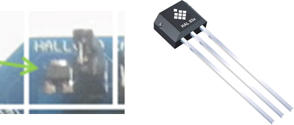

## Hall-Sensor 

 

Hall Sensor auf Shield und für Durchsteckmontage

- - - 
Ein [Hall Sensor](http://de.wikipedia.org/wiki/Hall-Sensor) (auch Hall-Sonde oder Hall-Geber, nach Edwin Hall) nutzt den Hall-Effekt zur Messung von Magnetfeldern.

Der auf dem Shield verwendetete Hall Sensor (A1202LH) kann zur Lage Erfassung eines Permanentmagnetes genutzt werden, d.h. es kann der Nordpol oder Südpol des Magneten bestimmt werden.

Die einte Pol schaltet das Signal auf > 0.9 und der andere Pol setzt das Signal wieder zurück.

Das [Beispiel](src/main.cpp) bringt, je nach Signal, LED D10 oder D11 zum Leuchten.

**Achtung**: der DIP-Switch, neben dem Hall Sensor, muss nach oben (on) zeigen.

### Anwendungen

*   Alarmanlagen, z.B. zum Sichern von Fenstern.
*   Im Auto zur Kontrolle ob der Sicherheitsgurt geschlossen ist, als Raddrehzahlsensoren, zur Erkennung des Zündzeitpunkts.
*   Zur Geschwindigkeitsmessung, z.B. für E-Bikes.
*   In der Kraftwerkstechnik zur Erfassung der Turbinendrehzahl.

### Links

*  [Arm Mbed Online Compiler](https://os.mbed.com/compiler/#import:/teams/IoTKitV3/code/HallSensor/)
