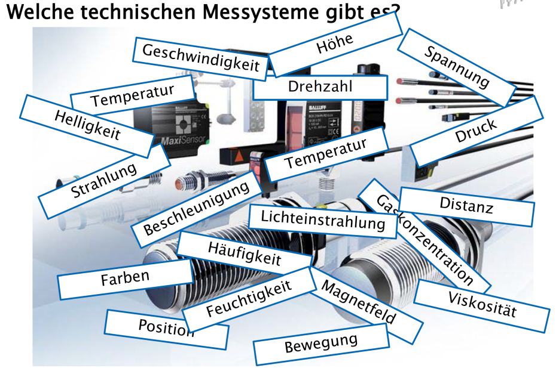
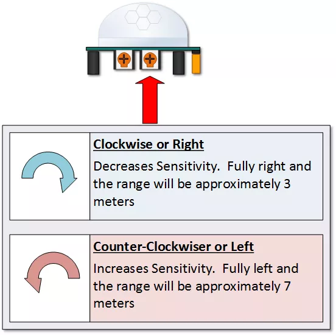

Sensoren
--------
***

> [⇧ **Home**](../README.md)

Source: Prof. Dr.-Ing. Michael Weyrich, http://wiki.zimt.uni-siegen.de/fertigungsautomatisierung

- - -

Sensoren sind technische Bauteile, die Eigenschaften der Umgebung (z. B.: Wärmestrahlung, Temperatur, Feuchtigkeit, Druck, Schall, Helligkeit oder Beschleunigung) erfassen und in ein weiter verarbeitbares elektrisches Signal umformen.

### Beispiele

* [Hall Sensor](#hall-sensor)
* [PIR Sensor](#pir-sensor)
* [Ultraschall Abstandsmesser](#ultraschall-abstandsmesser)
* [Temperatur Sensor](#temperatur-sensor) externe Variante
* [Übungen](#Übungen)

## Hall Sensor 
***

> [⇧ **Nach oben**](#beispiele)

 

Hall Sensor auf Kit und für Durchsteckmontage

- - - 

Ein [Hall Sensor](http://de.wikipedia.org/wiki/Hall-Sensor) (auch Hall-Sonde oder Hall-Geber, nach Edwin Hall) nutzt den Hall-Effekt zur Messung von Magnetfeldern.

Der auf dem IoTKit verwendetete Hall Sensor kann zur Lage Erfassung eines Permanentmagnetes genutzt werden, d.h. es kann der Nordpol oder Südpol des Magneten bestimmt werden.

Beim IoTKitV3 K64F: schaltet der  eine Pol das Signal auf > 0.9 und der andere Pol setzt das Signal wieder zurück.

Beim DISCO_L475VG_IOT01A: wird ein Wert < 0.4 oder > 0.6 für Nord- oder Südpool des Magneten angezeigt.

Das [Beispiel](HallSensor/src/main.cpp) bringt, je nach Signal, LED 1 oder LED 2 zum Leuchten.

**Achtung**: Beim IoTKitV3 K64F muss der DIP-Switch, neben dem Hall Sensor, nach oben (on) zeigen.  

### Anwendungen

*   Alarmanlagen, z.B. zum Sichern von Fenstern.
*   Im Auto zur Kontrolle ob der Sicherheitsgurt geschlossen ist, als Raddrehzahlsensoren, zur Erkennung des Zündzeitpunkts.
*   Zur Geschwindigkeitsmessung, z.B. für E-Bikes.
*   In der Kraftwerkstechnik zur Erfassung der Turbinendrehzahl.

### Beispiel(e)

Das [Beispiel](HallSensor/src/main.cpp) bringt je nach Pool eine LED zu leuchten.

### Compilieren

| Umgebung/Board    | Link/Befehl                      |
| ----------------- | -------------------------------- |
| Online Compiler           | [HallSensor](https://os.mbed.com/compiler/#import:/teams/IoTKitV3/code/HallSensor/) |
| CLI (IoTKit K64F)         | `mbed compile -m K64F --source . --source ../IoTKitV3/senors/HallSensor;`   `cp BUILD/K64F/GCC_ARM/template.bin $DAPLINK` |
| CLI (DISCO_L475VG_IOT01A) | `mbed compile -m DISCO_L475VG_IOT01A -f --source . --source ../IoTKitV3/sensors/HallSensor` |
| CLI (nucleo_f303re) | `mbed compile -m nucleo_f303re -f --source . --source ../IoTKitV3/sensors/HallSensor` |

## PIR Sensor 
***

> [⇧ **Nach oben**](#beispiele)

Reichweite/Funktionsweise 

- - - 

 

Empfindlichkeit 3 - 7 Meter 

- - -

 

Signal von 3 Sekunden bis 5 Minuten

- - -

 

Anschlüsse

- - -

Ein Bewegungsmelder ist ein elektronischer Sensor, der Bewegungen in seiner näheren Umgebung erkennt und dadurch als elektrischer Schalter arbeiten kann. Ein Bewegungsmelder kann aktiv mit elektromagnetischen Wellen (HF oder Doppelradar), mit Ultraschall (Ultraschall-Bewegungsmelder) oder passiv anhand der Infrarotstrahlung der Umgebung arbeiten; es gibt auch Kombinationen davon.

Der [PIR Sensor (Bewegungsmelder)](http://de.wikipedia.org/wiki/Bewegungsmelder) (englisch passive infrared) ist der am häufigsten eingesetzte Typ von Bewegungsmeldern. Er reagiert optimal auf Winkeländerungen, wenn also eine Person am Sensor vorbeigeht. Der PIR Sensor wird mittels 3-adrigen Kabel mit dem Shield verbunden.

### Anwendungen

*   Einschalten einer Beleuchtung
*   Auslösen eines Alarms

### Anschlussbelegung (Sensor - Shield) 

*   VCC - +5V (5 Volt)
*   OUT - A5
*   GND - GND (Ground)

### Beispiel(e)

Das [Beispiel](PIRSensor/src/main.cpp) bei Erkennung einer Bewegung wird eine LED eingeschaltet.

### Compilieren

| Umgebung/Board    | Link/Befehl                      |
| ----------------- | -------------------------------- |
| Online Compiler           | [PIRSensor](https://os.mbed.com/compiler/#import:/teams/IoTKitV3/code/PIRSensor/) |
| CLI (IoTKit K64F)         | `mbed compile -m K64F --source . --source ../IoTKitV3/senors/PIRSensor;`   `cp BUILD/K64F/GCC_ARM/template.bin $DAPLINK` |
| CLI (DISCO_L475VG_IOT01A) | `mbed compile -m DISCO_L475VG_IOT01A -f --source . --source ../IoTKitV3/sensors/PIRSensor` |
| CLI (nucleo_f303re) | `mbed compile -m nucleo_f303re -f --source . --source ../IoTKitV3/sensors/PIRSensor` |

### Links 

* [Arduino HC-SR501 Motion Sensor Tutorial](http://henrysbench.capnfatz.com/henrys-bench/arduino-sensors-and-input/arduino-hc-sr501-motion-sensor-tutorial/#attachment wp-att-2120/0/)

## Ultraschall Abstandsmesser 
***

> [⇧ **Nach oben**](#beispiele)

Timing

- - -

HC-SR04 

- - - 

Unter Entfernungsmessung, Abstandsmessung oder Längenmessung versteht man die Messung des Abstandes zweier Punkte im Raum durch direkten oder indirekten Vergleich mit einer Längenmasseinheit wie beispielsweise dem Meter.

Ein [Ultraschall Abstandsmesser](http://de.wikipedia.org/wiki/Entfernungsmessung) misst die Entfernung zu einem Objekt (z.B. Wand) in cm.

Der Erkennungszyklus wird mittels eines Impulses von min. 10 Mikrosekunden auf der "pulse trigger" Leitung (Trig) gestartet. Sobald diese Leitung wieder tief wird, sendet der Sensor eine Serie von acht Schaltimpulsen, wartet einen kurzen Moment und setzt dann die Leitung Echo hoch. Das erste Ultraschallecho welches Empfangen wird, setzt die Echo Leitung wieder tief. Durch die Zeitspanne dazwischen, lässt sich den Abstand zu einem Objekt bestimmen.

Die Ganze Arbeit nimmt uns die [SR04](http://developer.mbed.org/users/ejteb/code/HC_SR04_Ultrasonic_Library/) Library ab.

### Anwendungen 

*   Erkennen von Hindernissen bei Robotern

### Anschlussbelegung (Sensor - Shield)

*   VCC - V (5 Volt)
*   Trig - A4
*   Echo - A5
*   GND - G (Ground)

### Beispiel(e)

Das [Beispiel](UltraschallSensor/src/main.cpp) bei Erkennung einer Bewegung wird eine LED eingeschaltet.

Das Beispiel [UltraschallSensor_LowLevelV2](UltraschallSensor_LowLevelV2/src/main.cpp) zeigt, wie der Sensor ohne eine zusätzliche Library angesprochen werden kann.

### Compilieren

| Umgebung/Board    | Link/Befehl                      |
| ----------------- | -------------------------------- |
| Online Compiler           | [UltraschallSensor](https://os.mbed.com/compiler/#import:/teams/IoTKitV3/code/UltraschallSensor/) |
| CLI (IoTKit K64F)         | `mbed compile -m K64F --source . --source ../IoTKitV3/senors/UltraschallSensor;`   `cp BUILD/K64F/GCC_ARM/template.bin $DAPLINK` |
| CLI (DISCO_L475VG_IOT01A) | `mbed compile -m DISCO_L475VG_IOT01A -f --source . --source ../IoTKitV3/sensors/UltraschallSensor` |
| CLI (nucleo_f303re) | `mbed compile -m nucleo_f303re -f --source . --source ../IoTKitV3/sensors/UltraschallSensor` |
- - -
| Umgebung/Board    | Link/Befehl                      |
| ----------------- | -------------------------------- |
| Online Compiler           | [template](https://os.mbed.com/compiler/#import:/teams/IoTKitV3/code/template/) Importieren und Inhalt von main.cpp mit Beispielcode überschreiben |
| CLI (IoTKit K64F)         | `mbed compile -m K64F --source . --source ../IoTKitV3/senors/UltraschallSensor_LowLevelV2;`   `cp BUILD/K64F/GCC_ARM/template.bin $DAPLINK` |
| CLI (DISCO_L475VG_IOT01A) | `mbed compile -m DISCO_L475VG_IOT01A -f --source . --source ../IoTKitV3/sensors/UltraschallSensor_LowLevelV2` |
| CLI (nucleo_f303re) | `mbed compile -m nucleo_f303re -f --source . --source ../IoTKitV3/sensors/UltraschallSensor_LowLevelV2` |

## Temperatur Sensor 
***

> [⇧ **Nach oben**](#beispiele)

Beispiel Anwendung

- - -

DHT11

- - -

Der DHT11 ist ein multifunktionaler Sensor, der [Temperatur](http://de.wikipedia.org/wiki/Temperatursensor) und relative Luftfeuchte gleichzeitig misst. Er liefert zuverlässige Messwerte bei einer Luftfeuchtigkeit zwischen 20 % und 90 % und einer Temperatur zwischen 0 ° bis 50 ° Celsius.

Der Sensor benötigt die [DHT Library](http://developer.mbed.org/teams/components/code/DHT/)

**Tip:** zum Testen der Temperatur den Sensor zwischen die Hände halten. Zum Testen der Luftfeuchtigkeit, Sensor anhauchen.

### Anwendungen 

*   Überwachen Temperatur und Luftfeuchtigkeit
*   Ein- / Ausschalten der Heizung, Klimaanlage etc.

### Anschlussbelegung 

*   "+" - +5V (5 Volt)
*   OUT - A5
*   "-" - GND (Ground)

### Beispiel(e)

Das [Beispiel](TemperaturSensorExtern/src/main.cpp) gibt Temperatur und Luftfeuchtigkeit auf der Console aus.

### Compilieren

| Umgebung/Board    | Link/Befehl                      |
| ----------------- | -------------------------------- |
| Online Compiler           | [template](https://os.mbed.com/compiler/#import:/teams/IoTKitV3/code/template/) Importieren und Inhalt von main.cpp mit Beispielcode überschreiben |
| CLI (IoTKit K64F)         | `mbed compile -m K64F --source . --source ../IoTKitV3/senors/TemperaturSensorExtern;`   `cp BUILD/K64F/GCC_ARM/template.bin $DAPLINK` |
| CLI (DISCO_L475VG_IOT01A) | `mbed compile -m DISCO_L475VG_IOT01A -f --source . --source ../IoTKitV3/sensors/TemperaturSensorExtern` |
| CLI (nucleo_f303re) | `mbed compile -m nucleo_f303re -f --source . --source ../IoTKitV3/sensors/TemperaturSensorExtern` |

## Übungen
***

> [⇧ **Nach oben**](#beispiele)

**Hinweis**: Ein paar der Übungen funktionieren nur mit dem IoTKitV3 K64F, weil der Encoder benötigt wird.

| Übung                     | Lösung       |
| ------------------------- | ------------ |
| **PIR Sensor, Summer**Wenn sich jemand nähert, Licht einschalten und Akustisches Signal Anwendung: Alarmanlage. |  |
|  **Hall Sensor**Sobald kein magnetisches Feld mehr vorhanden, Akustisches Signal auslösen. Anwendung: Fenstersicherung.  |  |

### Compilieren

| Umgebung/Board    | Link/Befehl                      |
| ----------------- | -------------------------------- |
| Online Compiler | [template](https://os.mbed.com/compiler/#import:/teams/IoTKitV3/code/template/) Importieren und Inhalt von main.cpp Übungscode überschreiben |
| CLI (IoTKit K64F) | `mbed compile -m K64F --source . --source ../IoTKitV3/sensors/01-Uebung; `   `cp BUILD/K64F/GCC_ARM/template.bin $DAPLINK` |
| CLI (DISCO_L475VG_IOT01A) | `mbed compile -m DISCO_L475VG_IOT01A -f --source . --source ../IoTKitV3/sensors/01-Uebung` |
| CLI (nucleo_f303re) | - |

* *01-Uebung* durch entsprechendes Übung Verzeichnis *02-Uebung* etc. ersetzen.