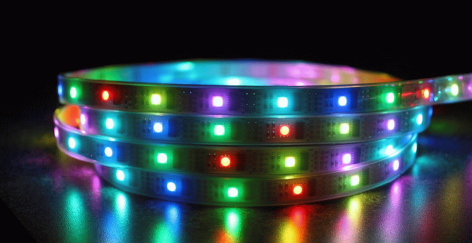

## Fernseh Simulator

[RGB LED Strip, siehe LadyAda Überguide](https://learn.adafruit.com/adafruit-neopixel-uberguide) 

- - -

Beispiel wie mit einen LED Strips (RGB LED Streifen) die Lichteffekte eines Fernseher nachgeamt werden können.

Es wird ein LED Strip mit einen IC pro RGB LED, d.h. jedes RGB LED kann einzeln via SPI Bus angesprochen werden, verwendet.

Die LED Strip wird an GND, 5V (!) und an die Datenpins CI - D13 (SLK), DI - D11 (MOSI) angeschlossen.

Auf dem Strip kommen [WS2801](http://www.adafruit.com/datasheets/WS2801.pdf) IC&#039;s zum Einsatz. Das Gegenstück zum WS2801 ist der [WS2811](https://www.adafruit.com/datasheets/WS2811.pdf) IC welcher aber nur mit ein paar mbed Boards funktioniert.

\*  [Arm Mbed Online Compiler](https://os.mbed.com/compiler/#import:/teams/IoTKitV3/code/FernsehSimulator/)
