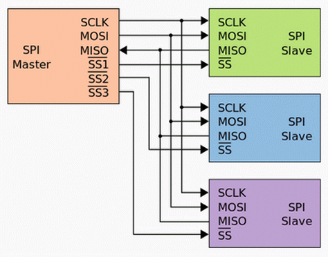

## SPI (Serial Peripheral Interface)
***

> [⇧ **Home**](../README.md)

SPI Sternverbindung [Quelle Wikipedia](http://de.wikipedia.org/wiki/Serial_Peripheral_Interface)

- - -

 

SPI-Verbindung durch Kaskadierung der Slaves [Quelle Wikipedia](http://de.wikipedia.org/wiki/Serial_Peripheral_Interface) 

- - -

Das Serial Peripheral Interface (kurz SPI) ist ein von Motorola entwickeltes Bus-System mit einem **„lockeren“ Standard** für einen synchronen seriellen Datenbus (Synchronous Serial Port), mit dem digitale Schaltungen nach dem Master-Slave-Prinzip miteinander verbunden werden können.

Es gibt drei gemeinsame Leitungen, an denen jeder Teilnehmer angeschlossen ist:

*   **SCLK** (englisch Serial Clock) auch SCK, wird vom Master zur Synchronisation ausgegeben
*   **MOSI** (englisch Master Output, Slave Input) oder SIMO (englisch Slave Input, Master Output)
*   **MISO** (englisch Master Input, Slave Output) oder SOMI (englisch Slave Output, Master Input)

Die Datenleitungen werden manchmal auch SDO (englisch Serial Data Out) und SDI (englisch Serial Data In) genannt. Wobei die Benennung meistens aus der Sicht des jeweiligen Busteilnehmers erfolgt und entsprechend zu verbinden sind, Bsp: Master MOSI (Master Output) mit Slave MOSI (Slave Input).

Je nach Anordnung der Slaves wird eine (bei Kaskadierung) oder mehrere (bei Stern) Chip-Select-Leitungen, welche alle vom Master gesteuert werden, benötigt. Diese Leitungen werden unterschiedlich mit Bezeichnungen wie SS, CS oder STE für Slave Select, Chip Select oder Slave Transmit Enable bezeichnet.

**Anders auf der Unterseite des Boards Beschriftet, teilen sich die SPI-1 und SPI-2 Anschlüsse die Pins MISO (PTD6), MISO (PTD7) und SLCK (PTD5), Unterscheiden jedoch SPI-1 SS (PTD4) und SPI-2 SS (PTE6). Damit können zwei Geräte an den gleichen SPI Bus angeschlossen, aber unterschiedlich, mittels dem SS Pin, angesprochen werden.** 

### Anwendungen 

*   Zugriff auf [SD Karten](http://de.wikipedia.org/wiki/SD-Karte), [RFID Reader](http://de.wikipedia.org/wiki/RFID)
*   Ansteuerung von [LED Strips](https://os.mbed.com/components/Pololu-Addressable-RGB-LED-Strip/), [LCD Displays](http://developer.mbed.org/users/dreschpe/code/SPI_TFT_ILI9341/)

## Beispiele

* [Dot LED Matrix](#dot-led-matrix)
* [RGB LED Streifen - SPI Version](#rgb-led-streifen)

## Dot LED Matrix
***

> [⇧ **Nach oben**](#beispiele)

 

Schaltplan Dot LED Matrix

- - -

Ein Punktmatrix-Display (Dot LED Matrix) ist ein Anzeigegerät um z.B. Fahrplaninformationen anzuzeigen.

Die Anzeige besteht aus einer Punktmatrix von LED&#039;s in einer rechteckigen Konfiguration angeordnet , so dass durch Zu- oder Abschalten der ausgewählten LED, Text oder Grafiken angezeigt werden können. Ein Punktmatrix-Controller wandelt Befehle von einem Prozessor in Signale (0, 1), so dass die gewünschte Anzeige erzeugt wird.

### Anwendungen 

*   Abfahrtszeiten von Zügen etc.
*   Fahrgast Informationen

### Anschlussbelegung (DotLEDMatrix - Shield) 

*   VCC - V (5 Volt)
*   GND - G (Ground)
*   DIN - MOSI 
*   CS - CS
*   CLK - SCLK 

### Beispiel(e)

* [DotLEDMatrix](DotLEDMatrix/src/main.cpp) gibt eine Laufschrift und nachher  Zahlen und Buchstaben auf dem Gerät aus.
* [DotLEDMatrixLowLevel](DotLEDMatrixLowLevel/src/main.cpp) bringt die LEDs einzeln zum Leuchten.

**Compilieren**

| Umgebung/Board    | Link/Befehl                      |
| ----------------- | -------------------------------- |
| Online Compiler | [DotLEDMatrix](https://os.mbed.com/compiler/#import:/teams/IoTKitV3/code/DotLEDMatrix/) |
| CLI (IoTKit K64F) | `mbed compile -m K64F --source . --source ../IoTKitV3/spi/DotLEDMatrix; `   `cp BUILD/K64F/GCC_ARM/template.bin $DAPLINK` |
| CLI (DISCO_L475VG_IOT01A) | `mbed compile -m DISCO_L475VG_IOT01A -f --source . --source ../IoTKitV3/spi/DotLEDMatrix` |
- - -
| Umgebung/Board    | Link/Befehl                      |
| ----------------- | -------------------------------- |
| CLI (IoTKit K64F) | `mbed compile -m K64F --source . --source ../IoTKitV3/spi/DotLEDMatrixLowLevel; `   `cp BUILD/K64F/GCC_ARM/template.bin $DAPLINK` |
| CLI (DISCO_L475VG_IOT01A) | `mbed compile -m DISCO_L475VG_IOT01A -f --source . --source ../IoTKitV3/spi/DotLEDMatrixLowLevel` |

## RGB LED Streifen
***

> [⇧ **Nach oben**](#beispiele)

[RGB LED Strip, siehe LadyAda Überguide](https://learn.adafruit.com/adafruit-neopixel-uberguide) 

- - -

LED Strips (RGB LED Streifen) eröffnen neue Möglichkeiten für die Dekorative Beleuchtungen von Gegenständen und Räumen.

LED Strips werden in den unterschiedlichsten Formen angeboten.

Es gibt unterschiedliche Arten der Ansteuerung, alle LED einer Farbe, jedes RGB LED einzeln.

Im aktuellen Beispiel verwenden wird ein LED Strip mit einen IC pro RGB LED, d.h. jedes RGB LED kann einzeln via SPI Bus angesprochen werden.

Die LED Strip wird an GND, 5V (!) und an die Datenpins CI - D13 (SLK), DI - D11 (MOSI) angeschlossen.

Auf dem Strip kommen [WS2801](http://www.adafruit.com/datasheets/WS2801.pdf) IC&#039;s zum Einsatz. Das Gegenstück zum WS2801 ist der [WS2811](https://www.adafruit.com/datasheets/WS2811.pdf) IC welcher aber nur mit ein paar mbed Boards funktioniert.

### Anwendungen 

*   Raumbeleuchtung
*   Dekorative Ausleuchtung von Gegenständen

### Beispiel(e)

* [RGBLEDStripSPI](RGBLEDStripSPI/src/main.cpp) bringt die verschiedenen Farben pro RGB LED zum leuchten.
* [FernsehSimulator](FernsehSimulator/src/main.cpp) simuliert mittels unterschiedlichen Farbvarianten einen Fernseher, z.B. um Einbrecher abzuschrecken.

**Compilieren**

| Umgebung/Board    | Link/Befehl                      |
| ----------------- | -------------------------------- |
| Online Compiler | [RGBLEDStripSPI](https://os.mbed.com/compiler/#import:/teams/IoTKitV3/code/RGBLEDStripSPI/) |
| CLI (IoTKit K64F) | `mbed compile -m K64F --source . --source ../IoTKitV3/spi/RGBLEDStripSPI; `   `cp BUILD/K64F/GCC_ARM/template.bin $DAPLINK` |
| CLI (DISCO_L475VG_IOT01A) | `mbed compile -m DISCO_L475VG_IOT01A -f --source . --source ../IoTKitV3/spi/RGBLEDStripSPI` |
- - -
| Umgebung/Board    | Link/Befehl                      |
| ----------------- | -------------------------------- |
| CLI (IoTKit K64F) | `mbed compile -m K64F --source . --source ../IoTKitV3/spi/FernsehSimulator; `   `cp BUILD/K64F/GCC_ARM/template.bin $DAPLINK` |
| CLI (DISCO_L475VG_IOT01A) | `mbed compile -m DISCO_L475VG_IOT01A -f --source . --source ../IoTKitV3/spi/FernsehSimulator` |
